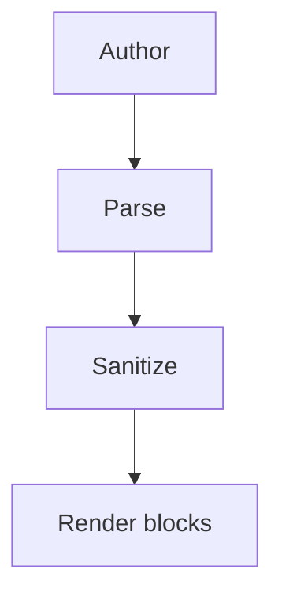
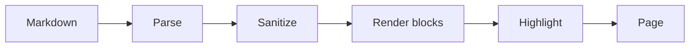

<!--meta
{
  "title": "Diagrams & Renderer Plugins",
  "description": "The extension point that turns a fenced code block into rich DOM — how to enable a diagram renderer, and how the core stays dependency-free.",
  "assumes": ["Docs/features/markdown"],
  "next": ["Docs/reference/config"]
}
-->

# Diagrams & Renderer Plugins

WebDocs renders every document with a from-scratch, zero-dependency engine, and
that rule is deliberately strict: nothing but hand-written vanilla JavaScript
ships to the browser. Diagram engines like Mermaid or PlantUML are large
third-party libraries, so they cannot be baked into the core without breaking
that promise.

The renderer plugin system is how the two are reconciled. The **core** provides a
small extension point — a registry that maps a fenced code block's language to a
renderer. **Plugins** live in a quarantined folder, are opt-in, and adapt an
external library to that registry. Enable one and ` ```mermaid ` blocks become
diagrams — the shipped `config.json` enables `mermaid` out of the box; enable
none and the tool behaves exactly as its dependency-free core always
has.

## Enabling a renderer

A renderer plugin is a file in `app/thirdpartyrenderer/`. To turn one on, list
its name in `plugins` in [`config.json`](Docs/reference/config):

```json
{
  "plugins": ["mermaid"]
}
```

On the next reload the browser loads `app/thirdpartyrenderer/mermaid.js`, which
registers itself for the `mermaid` language. From then on a fenced block tagged
`mermaid` is rendered as a diagram instead of shown as code:

````text

````

## Live example

With the `mermaid` plugin enabled and its library present, the block below is
rendered as an actual diagram — this is the document pipeline it belongs to:



If you are reading this on a checkout without the Mermaid library installed, the
same block instead shows its source with a short notice — the graceful fallback
described below.

## Bring your own library

The heavy third-party library itself is **never committed to this repository** —
that is what keeps a default checkout dependency-free. A plugin is only the thin
*facade*; you supply the engine it wraps. The Mermaid facade looks for its
library in three places, in order:

1. `window.mermaid`, if you have already loaded it in `index.html`;
2. a URL you set as `LIB_URL` inside the facade (a CDN or a self-hosted copy) — a
   set `LIB_URL` wins over the local file;
3. otherwise a local `app/thirdpartyrenderer/mermaid.min.js` you drop in beside
   the facade.

If none is present, the block does not silently disappear: it falls back to
showing its source with a short note explaining that the library was not found.
The application keeps working regardless — a missing or broken plugin can never
stop the site from loading.

## What "PlantUML" means here

PlantUML has no production in-browser engine — every integration offloads the
actual drawing to a server (a PlantUML server or a Kroki instance). A PlantUML
plugin therefore follows the same facade pattern but, instead of calling a local
library, encodes the diagram source and points an image or fetch at that server
URL. It is the same contract as the Mermaid facade with a different body, which
is exactly the point of the extension system: the core never changes.

Because such a plugin reaches a network service, it trades one of the tool's
guarantees (no third-party code ships) for a different cost (a request leaves the
browser when a diagram renders). That is a conscious choice you make per plugin,
not something the core decides for you.

## How it fits the pipeline

Rendered blocks are produced by a stage in the [render
pipeline](Docs/design/architecture) that runs **after** the Markdown is parsed
and sanitized, alongside the syntax highlighter and the requirement-table
renderer. Running post-sanitize means a plugin builds trusted DOM directly —
which is how a diagram's SVG survives, since the allowlist sanitizer strips raw
`<svg>` from *document* markup.

That freedom is balanced by a safety net. A third-party engine turns document
text into markup that could carry a `<script>`, an inline event handler, or a
`javascript:` URL, so every fragment a plugin produces is passed through a
defensive scrub before it stays on the page: scripts and event handlers are
removed while the diagram's shapes are left intact. Enabling a diagram plugin
still widens your trust boundary to that library and your own authors — the scrub
is defence-in-depth, not a licence to render untrusted input.

## Writing your own

Any fenced language can be claimed by a renderer. A plugin file imports
`registerBlockRenderer` from the core and provides a function that receives the
block's text and returns a DOM node (or a promise for one, for engines that load
or parse asynchronously). The `README.md` note in `app/thirdpartyrenderer/` and
the Mermaid facade beside it are the working template — copy it, change the
language it claims and the engine it wraps, and add the name to `plugins`.
