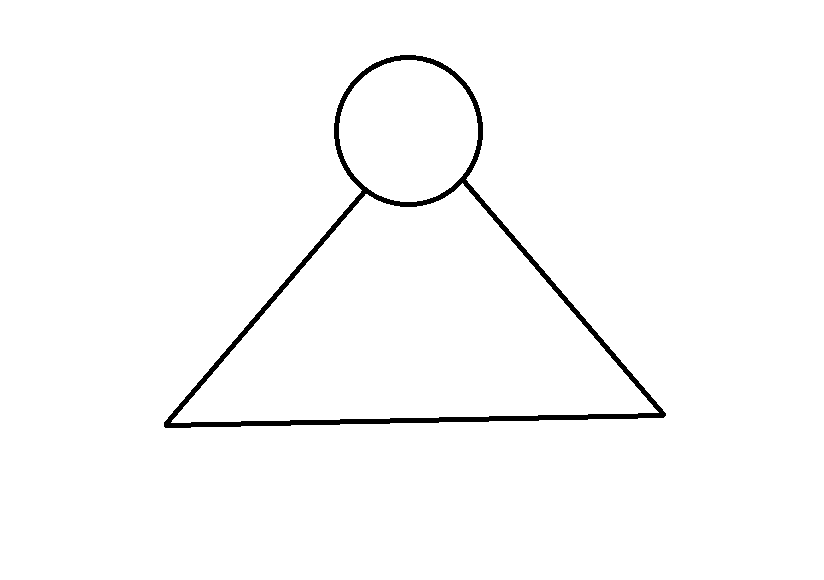

<!--meta
{
  "title": "Markdown & GFM",
  "description": "Full CommonMark plus GitHub-flavored tables, task lists, strikethrough and autolinks.",
  "assumes": [
    "Docs/overview"
  ],
  "next": [
    "Docs/features/highlighting"
  ]
}
-->

# Markdown & GFM

Every document you read in WebDocs is plain Markdown. There is no build step and
no third-party Markdown library: the text is fetched as-is and rendered in the
browser by a hand-written CommonMark 0.31.2 engine, extended with the parts of
GitHub-Flavored Markdown that documentation actually needs. If you can write a
README, you can author for WebDocs.

This page is written to be read *and* rendered — it is a working sample. Every
construct below is live output from the same engine, so what you see is exactly
what the parser produced.

## What the engine supports

The renderer covers the full CommonMark block and inline grammar, plus four GFM
extensions layered on top:

- **CommonMark 0.31.2** — headings, paragraphs, lists, block quotes, code
(indented and fenced), thematic breaks, links, images, emphasis and HTML
blocks. Conformance sits at 99.5% of the official spec suite, as measured by
the in-repo conformance harness (`app/dev/conformance-full.html`).
- **Tables** — pipe tables with per-column alignment.
- **Task lists** — `- [x]` / `- [ ]` checkboxes inside list items.
- **Strikethrough** — `~~text~~`.
- **Autolinks** — the GFM extension auto-detects and links bare `https://…`
URLs, `www.`-prefixed URLs and bare email addresses without any surrounding
markup, on top of CommonMark's own `<https://…>` angle-bracket autolinks.

For how the two-phase parser and the separate sanitizer actually work, see
[the CommonMark engine](Docs/design/parser). The next stop after this page is
[syntax highlighting](Docs/features/highlighting), which decorates fenced code
blocks once the Markdown is parsed.

## Inline formatting

Inline text mixes freely: you can write **bold**, *italic*, ***both at once***,
`inline code`, and ~~struck-through~~ spans in the same sentence. Backticks
protect their contents, so `**stars stay literal here**` is rendered verbatim.
Autolinks such as [https://spec.commonmark.org/0.31.2/](https://spec.commonmark.org/0.31.2/) are detected and linked
without any extra markup, and ordinary links like
[the map view](Docs/features/map) point at other documents by their id.

## Headings and structure

Headings drive the on-this-page contents list. You write `##` and `###` and the
numbering — 1, 1.1, 1.2 — is added automatically at render time. Never number a
heading by hand; the engine owns the numbers.

### A third-level heading

Sub-sections nest under their parent and inherit the numbering, which is how the
contents pane mirrors the document outline.

## Lists

Unordered, ordered and nested lists all parse, including mixed nesting:

- Rendering
Block phase (structure)
Inline phase (emphasis, links, code)
- Block phase (structure)
- Inline phase (emphasis, links, code)
- Navigation
Document tree
On-this-page contents
Deep-link routing
- Document tree
- On-this-page contents
- Deep-link routing
- Highlighting
Per-language tokenizers
- Per-language tokenizers

Ordered lists keep their start value and can carry nested content of their own:

1. Fetch the raw Markdown for the requested document.
1. Extract requirement groups, then parse the remaining Markdown.
1. Sanitize, number headings, decorate, and inject into the page.

## Task lists

Checkbox items render as real (read-only) checkboxes:

- Parse CommonMark block structure
- Parse inline emphasis and links
- Add GFM tables, task lists, strikethrough, autolinks
- Anything a documentation reader could still want

## Tables

Pipe tables support left, center and right column alignment:

## Block quotes and thematic breaks

> Documentation is a conversation with a future reader. The engine keeps that
> conversation legible: block quotes can span multiple lines and can themselves
> contain **formatting** and `code`.

A thematic break separates one train of thought from the next:

---

After the break, normal flow resumes. Combined, these primitives are enough to
write anything from a one-paragraph note to a fully cross-linked specification —
all in the same portable Markdown, rendered the same way everywhere.

| Column 1 | Column 2 |
| --- | --- |
| \*\*\*This \*\*\*is a test |  |
