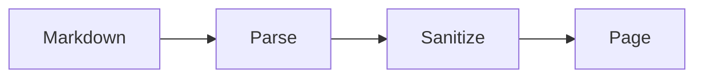
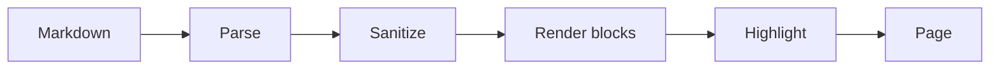

<!--meta
{ "title": "How-To Guide", "description": "Task-oriented recipes for the everyday WebDocs jobs — reading and searching the set, using the map, authoring and linking documents, adding diagrams, tracing requirements, and checking test coverage.", "assumes": ["Docs/overview"], "next": ["Docs/reference/authoring", "Docs/reference/config"] }
-->

# How-To Guide

This guide collects the everyday jobs you do with WebDocs and shows you how to
do each one — nothing more. It favours doing over explaining: each recipe is a
few tight steps, and where a job carries rules and edge cases the recipe hands
you off to the reference and feature documents that cover them in full.
Everything here is plain Markdown with no build step, so the loop never changes
— save a file and it is part of the set.

## Get WebDocs running

WebDocs is served by a small, dependency-free server that hands the browser the
reader app and your Markdown as-is. There is no compile step and no bundler —
the engine parses and renders each document in the browser at read time. To
stand up a set of your own:

- Tell the server where your documents live. Each source folder is declared in
  `config.json` with a name and a component id; the name becomes the first
  segment of every document id beneath it.
- Open the app in a browser. WebDocs discovers every `.md` file under each
  source on load, builds the tree, the search index, and the map, and opens the
  default document.
- Add or change a document and reload. Because discovery runs on load, a new
  file joins the set the next time the library loads — no configuration change
  and no restart.

The full list of keys — `sources`, the default document, `plugins`, and
per-source test results — lives in
[the configuration reference](Docs/reference/config).

## Read and navigate the document set

WebDocs gives you four ways to move around: the document tree, the contents
pane, the breadcrumb trail, and deep links.
[Navigation](Docs/features/navigation) describes each in depth; the recipes here
are the short version.

### Move between documents

Open the tree drawer with the hamburger button — the menu icon at the far left
of the header, labelled "Open document navigation". The drawer lists every
document as a folder tree derived from the document ids: source folders sit at
the top and open by default, sub-folders start collapsed. Click a document
title to go there, and the drawer closes behind you; Ctrl-, Cmd-, or
Shift-click opens it in a new tab instead. The document you are reading is
marked as the current page and scrolled into view, so re-opening the drawer
always shows where you are. Close the drawer with its ✕ button, by clicking the
dimmed backdrop, or by pressing Escape.

### Follow the contents pane

The left-hand "On this page" pane lists the current document's headings as a
numbered outline. WebDocs numbers the headings for you — 1, 1.1, 1.2.1, and so
on — and the same numbers appear in the body, so the outline and the page can
never drift apart. Click an entry to scroll that heading to the top of the
content; the pane also tracks your position as you scroll, highlighting the
section you are reading. Clicking an entry scrolls without changing the URL, so
you can range around a long document freely.

### Read the breadcrumb trail

The breadcrumb trail in the header shows where the current document sits, as its
id path with " › " separators — a document with id `Docs/features/map` reads as
Docs › features › map. It is a location indicator, not a set of links: there is
nothing to click. To move up or across, use the tree drawer.

### Deep-link to a document, heading, or requirement

Every document has a stable URL you can share:

- To a document — append `#/<id>` to the app URL, for example
  `#/Docs/features/map`. The id mirrors the folder path you see in the
  breadcrumbs.
- To a heading — every heading gets a slug id, so an in-page `#anchor` scrolls
  straight to that section.
- To a requirement or test — append `?req=<id>` or `?test=<id>` to a document
  route. WebDocs scrolls the item to the centre of the view and flashes it
  briefly so you can spot it.

An unknown document id falls back to the default document rather than erroring.

## Search within a page and across the set

### Find text on the current page

The "Find in page…" box in the header highlights matches in the document you are
reading. Type at least two characters; every occurrence is highlighted and the
first is scrolled to the centre of the view. It searches only the current
document and skips text inside code blocks, so a term that appears only in a
code sample will not match. There is no next/previous stepping and no match
count — all matches stay highlighted, so scroll to reach the later ones. Clear
the box, or drop to a single character, to remove the highlights.

### Search every document

To search the whole set, open the tree drawer and type in "Search all
documents…". This matches document titles and their headings — not full body
text — as a case-insensitive substring, and returns up to fifty results ranked
with title matches first. A single character is enough to start. Click a result
to open that document; Ctrl-, Cmd-, or Shift-click opens it in a new tab. For
the difference between the two boxes, see [Search](Docs/features/search).

## Explore the map

The map is a full-screen picture of how your documents relate. Open it with the
map button in the header — the ◱ icon, titled "Map" — and the same button or the
Escape key closes it. The map and the test-coverage view are mutually exclusive:
opening one closes the other.

Single-click and double-click do different things:

- Single-click a document node to select it and stay on the map. The map keeps
  its place so you can carry on exploring, and the selected document is the one
  you land on when you leave.
- Double-click a node to open that document and close the map.

Enter or Space on a focused node selects it, the same as a single click.

Pan by dragging the background; zoom with the mouse wheel toward the cursor, or
with the +, −, and ⤢ (fit to view) buttons on the canvas. The minimap in the
corner shows the whole graph and your current viewport — click it to recentre.
The "Find a document…" box locates a node by title or id, centres it, and
flashes it, but does not select it.

The legend down the side is a set of toggles — click one to hide or show that
kind of edge or node without moving anything else:

- Prerequisite — "read this first" edges from a document's `assumes` list.
- Recommended next — "read this after" edges from a document's `next` list.
- Requirement trace — requirement traces, collapsed to document-to-document
  edges (shown only when such edges exist).
- Page link — plain in-body links from one document to another (shown only when
  such links exist).
- Missing — placeholder nodes for ids that are referenced but not real
  documents.

An ordinary in-body link to another document becomes a page-link edge. A link to
an outside URL becomes a URL box with a small "?" bubble in its corner; click it
to open that address in a new tab, leaving the map and your place untouched.
[The Map View](Docs/features/map) covers the full model.

## Author a new document

Authoring can be fully visual: WebDocs edits a document as a stack of blocks and
serializes them back to a `.md` file — though you can still write that file by
hand (see [the authoring reference](Docs/reference/authoring)).

### Create the document

Click the ＋ button in the header, titled "New document". In the dialog:

- Pick a component / source — the folder your document belongs to. The source
  name becomes the first segment of the document id.
- Type a path — the folders and name beneath that source, for example
  `guides/setup/installation`. Do not add `.md`, and leading and trailing
  slashes are trimmed. A live "Will create:" line previews the resulting id.

Paths may contain letters, numbers, and `-` `_` `/` only, and the id must not
already exist. On Create, WebDocs derives a starting title from the last path
segment, opens the editor with a level-1 heading and one empty paragraph, and
you are ready to write.

### Write the metadata header

Every document opens with a metadata header — an HTML comment whose body is a
single JSON object, read and removed before the Markdown is parsed, so it never
shows on the page. The editor's "Document metadata" panel writes these fields
for you, but it is worth knowing the shape:

```text
<!--meta
{
  "title": "Installing WebDocs",
  "description": "Get the server running and open your first document.",
  "assumes": ["Docs/overview"],
  "next": ["Docs/reference/authoring"]
}
-->
```

- `title` — the display name; keep it identical to the single # H1 that
  follows. It feeds the tree, the search index, the map node, and the browser
  tab.
- `description` — a one-line summary, rendered as the lede beneath the H1.
- `assumes` — prerequisite document ids, drawn as prerequisite edges on the map
  and as "assumed knowledge" links in the footer. May be empty.
- `next` — recommended-next document ids, drawn as recommended-next edges and
  footer "next" links. May be empty.

Every id in `assumes` and `next` must be a real document id.

### Edit an existing document

To change a document you are reading, click the floating pencil button (✎, "Edit
this document") at the bottom of the content. WebDocs turns the stored Markdown
back into editable blocks — headings, text, lists, code, tables, quotes,
images, requirement groups, and test cases — with the auto-generated section
numbers stripped, so you only ever see and edit the heading text.

### Link to other documents

Inside a text block, select some text and click the 🔗 button to open the link
popover. Its URL box autocompletes against your documents: pick one and it
inserts that document's id — no `.md`, no leading slash. Type a real URL (one
starting with a scheme, `/`, `./`, `../`, `#`, `mailto:`, or `tel:`) and the
document suggestions step aside so external links work freely. A bare domain
such as example.org gets `https://` prepended, and unsafe schemes such as
`javascript:` are rejected. If you are writing Markdown by hand instead, an
internal link is just the id:

```text
[the configuration reference](Docs/reference/config)
```

An in-body link to another document that is not already an `assumes`, `next`, or
trace relationship is drawn on the map as a page-link edge, so cross-references
show up as structure, not clutter — use them freely but deliberately.

### Save

Click Save. WebDocs serializes every block back to Markdown, writes the whole
file to its source folder, and then re-discovers the set — so a brand-new
document appears in the tree, search, and map straight away, with no config
change and no restart. The header is always written with the four fields
`title`, `description`, `assumes`, and `next`, in that order.

## Write your content

Whatever you type in a text block is Markdown underneath, and you can also
hand-author `.md` files directly. WebDocs runs a from-scratch CommonMark 0.31.2
engine — no third-party Markdown library — plus a handful of GitHub-flavored
extensions.

### Use Markdown and GFM

You have the full CommonMark grammar: headings, paragraphs, lists, block quotes,
fenced and indented code, thematic breaks, links, images, and emphasis. On top
of that WebDocs adds four GFM extensions:

- Tables — pipe tables with per-column alignment (`:---` left, `:---:` centre,
  `---:` right).
- Task lists — `- [x]` and `- [ ]` render as real but read-only checkboxes.
- Strikethrough — `~~text~~`.
- Autolinks — a bare URL in running text, `https://example.com` or
  `www.example.com`, becomes a link (no angle brackets needed).

One rule matters more than the rest: never number a heading by hand. WebDocs
numbers headings hierarchically at render time and mirrors those numbers into
the contents pane — type your own and you end up with two sets that drift apart.
See [Markdown & GFM](Docs/features/markdown) for the full grammar.

### Tag a code block for highlighting

WebDocs highlights fenced code itself — no highlight.js, no Prism, no network
call. Tag the opening fence with the language name:

````text
```python
def hello():
    return "hi"
```
````

Five languages have a dedicated, purpose-built highlighter, each with its own
fence tags:

- Python — `python`, `py`
- Robot Framework — `robotframework`, `robot`
- Makefile — `makefile`, `make`, `mk`
- Shell — `shell`, `sh`, `bash`, `console`, `zsh`
- Java — `java`

Any other tag still gets light, generic colouring for comments, strings, and
numbers, so you lose nothing by tagging a language WebDocs does not know by
name. A fence with no tag at all is left as plain monospaced code. The practical
rule is simple: always tag your fence.
[Syntax Highlighting](Docs/features/highlighting) lists the details.

### Embed HTML for structure Markdown lacks

Raw HTML is allowed in a document, but a sanitizer runs after parsing and before
anything reaches the page, and its policy is strict: embedded HTML is allowed,
but all styling and scripting is rejected. Use it for semantic structure
Markdown does not offer — `<details>`/`<summary>` for collapsible sections,
`<sub>`/`<sup>`, `<mark>`, `<ins>`, `<figure>`/`<figcaption>`, and tables with
`colspan`/`rowspan` — never for appearance. There is no `style` attribute, no
`id`, and no arbitrary `class`; scripts, iframes, forms, media, and even raw
`<svg>` are removed outright. The one class that survives is a `language-*` hint
on `<code>` or `<pre>`, which is what lets the highlighter find the grammar.
Links keep only `href` and `title`, and only safe URL schemes survive.

## Add a diagram

WebDocs' core renders everything itself and ships no third-party code, so heavy
diagram engines are not baked in. Instead a renderer plugin system lets you opt
in: enable the Mermaid plugin and a fenced block tagged `mermaid` becomes a
diagram; enable nothing, the default, and the same block is just highlightable
code. Write the diagram as a `mermaid`-tagged fence:

````text

````

With the plugin enabled it renders as a diagram — the pipeline a document
travels through looks like this:



To enable the plugin, add its name to the `plugins` array in `config.json`:

```json
{ "plugins": ["mermaid"] }
```

On the next reload the loader imports the Mermaid facade from
`app/thirdpartyrenderer/`, which registers itself for the `mermaid` language. A
missing or broken plugin is logged and skipped — it can never stop the app from
loading.

The heavy Mermaid library is never committed, so a default checkout stays
dependency-free: the plugin file is only a thin facade, and you supply the
engine it wraps. The facade looks for the library in three places — a
`window.mermaid` you loaded yourself; otherwise `LIB_URL` if you set it;
otherwise a local `mermaid.min.js` beside the facade (the default, since
`LIB_URL` is empty). Without a library the block falls back gracefully to its
source plus a short notice, and the page runs exactly as before.

Every rendered diagram sits in a pan/zoom frame. Drag to pan; use the +, −, and
↺ (fit to view) buttons, which always work; and, once the frame has focus, zoom
with the mouse wheel — so scrolling past a diagram is never trapped. With the
frame focused, arrow keys pan, + and - zoom, and 0 fits; you can also drag the
frame's bottom edge to make it taller.
[Diagrams & Renderer Plugins](Docs/features/diagrams) covers writing your own
renderer.

## Trace requirements

A requirement group is an ordinary GFM table wrapped in a matched pair of meta
comments. WebDocs lifts the wrapped region out before parsing and rebuilds it as
a live, cross-linked table.

### Author a requirement group

Wrap a three-column table in the group markers:

```text
<!--meta start {"requirement-group":"nav"}-->
| requirement-no | description                          | trace-to |
| -------------- | ------------------------------------ | -------- |
| 1              | Present the set as a folder tree.    | sys_3    |
| 2              | Show the current headings as a list. | 1, sys_3 |
| 3              | Deep-link to any document.           |          |
<!--meta end {"requirement-group":"nav"}-->
```

The opening marker names the group as JSON; the closing marker ends the region.
The three authored columns are `requirement-no` (aliases `req-no`, `no`,
`requirement`, `#`), `description` (free text, rendered as inline Markdown), and
`trace-to`. Header matching is case-insensitive. Each row is given a stable id
built from three parts — the component, taken from the source's configuration in
`config.json` (`WD` for the Docs source), the group name, and the row number —
and the badge you see on the rendered row reads like `R_WD_NAV_1`.

### Trace to another requirement

`trace-to` holds requirement references only — never free text and never a
document id. There are three shorthands, resolved relative to the row you are
writing:

- A bare number — `2` — points at that number in the same group.
- `group_no` — `sys_1` — points at another group in the same component.
- A fully composed id points anywhere, across components.

Separate several targets with commas, and leave `trace-to` blank for a top-level
requirement. You never author the inverse: WebDocs computes Trace From by
inverting every resolvable `trace-to`, so a requirement shows both what it
depends on and what depends on it. Only resolvable references contribute — a
reference that resolves to nothing is flagged in the Trace To cell as a ⚠ chip,
and produces no inverse link and no map edge.

### Read the rendered table

On the page the group becomes a captioned, scrollable table. Trace To and Trace
From render each reference as a `#/<docId>?req=<id>` link that jumps to the
document defining the target requirement and flashes that row — so a trace is a
real cross-document jump, not just text. Empty cells show an em-dash. The
current build also renders a Verified By column, which lists any test cases
whose metadata points at the requirement; it stays empty until a test does.

On the map, resolved traces appear as requirement-trace edges: WebDocs collapses
requirement-to-requirement links to a single edge per ordered document pair and
omits traces that stay inside one document. Toggle them with the map's
"Requirement trace" legend button.
[Requirements Traceability](Docs/features/requirements) has the complete rules.

## Check test coverage

The coverage view is a full-screen picture of which requirements are verified.
Open it with the ✓ button in the header, titled "Test coverage"; the button
toggles it, and Escape closes it — closing the report panel first if that panel
is open. Like the map, it is mutually exclusive with the map view.

The view is a colour-coded graph of requirement nodes with their test cases
hanging off them. Each node is coloured by its rolled-up status:

- pass — green
- fail — red
- partial — yellow
- untested — blue

A requirement's caption reads "<n>% passing", or "untested" when it has no
evidence yet; a test's caption is Pass, Fail, Partial, or Untested. The legend
— Passing, Failing, Partial, Untested — filters the graph by status, hiding all
nodes of a status and any edge that touches them. Two toolbar buttons sit on the
overlay: "▷ Run tests" opens the runner for every test case, and "⤓ Export
report" downloads a self-contained HTML report you can share.

### Open a requirement's report

Click any node to open its report panel on the right. A requirement's panel
shows its description, an "Open in its document ↗" link, an "Automated results"
section with one row per recorded result, and a "Test cases" list — its computed
Verified By tests, each clickable through to its own report. A search box at the
foot of that list lets you link an existing test case to the requirement.

### Record manual tests

Manual evidence is recorded through the runner, reached from "▷ Run tests" (all
tests) or "▷ Run this test" on a test-case report. The runner is a checklist
grid: for each test you fill an "Actual response" against each expected step and
toggle the step ✓ (pass) or ✗ (fail) — an untouched step is not recorded. Enter
your name in the "Tester" field and click "Save run"; only the tests you touched
are written, and the graph and page recolour. Manual results are stored per
source in a hidden sidecar file, keyed by test or requirement id. See [the test
coverage view](Docs/features/test-coverage) for how the statuses roll up.

## Switch between day and night

WebDocs ships a day theme and a night theme and applies your content correctly
to both automatically — you never write CSS, and there is nothing to set per
document. Switch with the theme button at the top right, titled "Day / night".
It shows a moon while you are in day mode — click it for night — and a sun while
you are in night mode — click it for day; the glyph is always what you switch
to. Your choice is remembered across reloads and sessions, and overrides the
operating system preference from then on. Because colours come entirely from
theme tokens, highlighted code and every surface read correctly in both themes.
[Theming](Docs/design/theming) explains the token model.

## Configure WebDocs

Everything outside a single document — which folders are sources and their
component ids, the default document, which renderer plugins load, and where each
source's automated test results live — is set in `config.json`. [The
configuration reference](Docs/reference/config) documents every key.

## Where to go next

When a recipe here stops short of the fine print, the reference documents take
over: [the authoring reference](Docs/reference/authoring) for the full rules of
writing a document, and [the configuration reference](Docs/reference/config) for
standing up and tuning the set.
