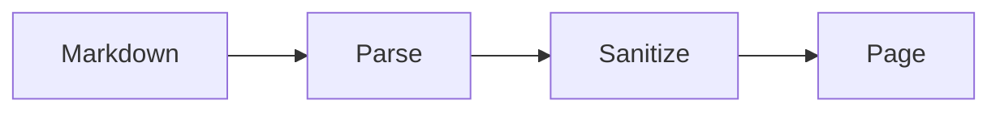
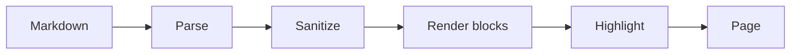

<!--meta
{ "title": "Add a Diagram", "description": "Turn a fenced block into a rendered, pannable diagram with the Mermaid plugin.", "assumes": ["Docs/how-to/writing"], "next": ["Docs/how-to/requirements"] }
-->

# Add a Diagram

WebDocs' core renders everything itself and ships no third-party code, so heavy
diagram engines are not baked in. Instead a renderer plugin system lets you opt
in: enable the Mermaid plugin and a fenced block tagged `mermaid` becomes a
diagram; enable nothing, the default, and the same block is just highlightable
code. Write the diagram as a `mermaid`-tagged fence:

````text

````

With the plugin enabled it renders as a diagram inside a frame you can pan and
zoom — here is the pipeline a document travels through:




Every rendered diagram sits in a pan/zoom frame. Drag to pan; use the +, −, and
↺ (fit to view) buttons, which always work; and, once the frame has focus, zoom
with the mouse wheel — so scrolling past a diagram is never trapped. With the
frame focused, arrow keys pan, + and - zoom, and 0 fits; you can also drag the
frame's bottom edge to make it taller.

To enable the plugin, add its name to the `plugins` array in `config.json`:

```json
{ "plugins": ["mermaid"] }
```

On the next reload the loader imports the Mermaid facade from
`app/thirdpartyrenderer/`, which registers itself for the `mermaid` language. The
heavy Mermaid library is never committed, so a default checkout stays
dependency-free — you supply the engine, and without it the block falls back
gracefully to its source plus a short notice.
[Diagrams & Renderer Plugins](Docs/features/diagrams) covers writing your own
renderer.
